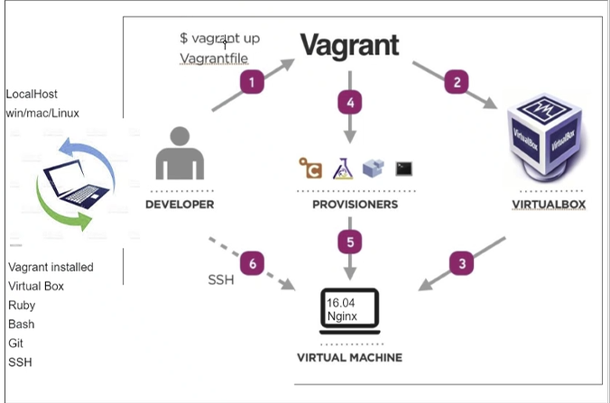

# devops
## what is devops
devops is a new culture in IT departments that bridges the gap between 
the development and the operations teams.
It allows for faster delivery of software.

-working togheter: everyone is responsible for the whole software development
life cycle: plan - develop - build - test - deploy

-share responsibility: it eliminates the blame culture

-automation

-infrastructure as code 

### Benefits of DevOps

#### DevOps four key pillars

- easy of use: With DevOps, documentation does not come in the form of a user manual.
In DevOps environments, it is preferable for the code to speak for itself.
Documentation generators can be helpful here. 
When an instruction is reduced to run `vagrant up` and the steps
themselves are written as reproducible code, mistakes are much less likely to occur. Using configuration
management (CM) and Infrastructure as Code (IaC) can also serve as a good documentation.

- flexibility: Extending an ability to extend and replace the existing tool sets, DevOps lends a helping hand when it comes to sustaining future technologies. Facilitates business growth and change: DevOps help facilitate change and business growth, by ensuring best practices are followed at all given periods of time.

- robustness: System robustness is achieved by eliminating single points of failure in the system that would prevent successful transition. Often, the points of failure are related to people, technologies, tools or documentation.

- cost effective: DevOps drives better productivity from less staff, thereby curtailing the expenditure on development and operations personnel.

# Steps to have our virtual machine set up:

1- Install Vagrant

2- Install Virtual Box

3- For Windows users, after installing Virtual Box, we will need to manually install the drivers

4- Using Power Shell as administrator, we type the command sc start vboxdrv

5- We create a vagrantfile in the same folder where we have our GitHub repository with the instructions to create the virtual machine using Virtual Box

6- In the Git Bash terminal we type: vagrant up, this will create the virtual machine for us

7- With vagrant status, we check the status of the virtual machine

8- With vagrant ssh, we can access our virtual machine in the terminal

9- Finally, we updated Ubuntu, typing sudo apt-get update

10- To exit the VM ssh `exit` - 

11- To power off the VM `vagrant halt`. To start it again `vagrant reload`

12- To delete the VM `vagrant destroy`

# Introduction to Linux

### Linux - Ubuntu distro
- update `sudo apt-get update -y`
- upgrade `sudo apt-get upgrade -y`
- Who am I `uname` or `uname -a`
- Where am I `pwd` (print working directory)
- How to check files/folders in existing location `ls` or `ls -a`
- How to create a directory `mkdir dir_name` 
- Navigate to any folder - change dir `cd folder_name`
- How to change back to home location or any location `cd ..` or `cd` + enter
- How to create a file `touch file_name` or `nano file_name`
- To see the content of the file on terminal `cat file_name`
- How to copy file `cp location/file_name to destination_path`
- Create a folder called test in current location
- Cut & paste the file inside the test folder from current location `mv text.txt test` (file_name directory)
- How to delete them `rm -rf folder_name` (-rf deletes everythin that is inside the folder)
- How to check running processes (Task manager) `top` `ps aux` (more information)
- How to delete/remove/kill any process `kill pid` (process id)

### Permissions
- How to check permissions `ll`
- How to switch to `root user` `sudo su` (super user) (exit)
    it is not a good practice to use it on a daily basis    
- How to change permissions `chmod instruction file_name`
    `chmod +x file_name` `chmod 400 file_name`
- How to launch a process for 30 seconds `your_command timeout 30s `
- How to kill a process  `your_command sleep 30s`
- How to install a product (program or VM, etc) - install web server called `nginx` (web server used for reversed proxy)
    `sudo apt-get install nginx`
- How to check the status `systemctl status nginx`
- `sudo chmod +x provision.sh`

### Env Variable
- How to check existing `Env var`
- How to print specific env var `printenv NAME`
- How to create an env var
- The key word `export` `export Key=value`
- How to make an env var persistent on Linux Ubuntu `nano /home/user/.bashrc` global variable `nano /etc/environment`
    `export GLOBAL="This is a global variable"`
    `source /etc/environment`
    `echo $GLOBAL`

# Vagrant - Provisioning

### create a private network with provided IP address
    config.vm.network "private_network", ip: "192.168.10.100"

### Provisioning task

1- Create a provision.sh file on the localhost, NOT on the VM

2- Add the script on the file to update the VM, install and start nginx `sudo apt-get install nginx -y`    

3- Update the vagrantfile script adding the 

`config.vm.provision "shell", path: "provision.sh"`

This script will allow us to run the shell file at the boot time of the VM. With the single command of `vagrant up` it will also run the script.

4- On the first vagrant up that creates the environment, provisioning is run. If we want to run again the provision file we have to type `vagrant up --provision`

5- After I finished this task I was able to access nginx on my browser on the url http://192.168.10.100/ without ssh into the VM

# Vagrant - Explanation of the diagram
Vagrant is a virtual machine manager. It allows us to script the virtual machine configuration. Vagrant is used to develop a consistent development environment and to improve consistency between development environments and deployed servers.

1) The command `vagrant up` will execute the vagrantfile with the script with the virtual machine configuration

We can install our development environment on any virtualisation provider. If we just want to try on a local system, we can use VirtualBox or VMWare or if we want to host to the cloud, Vagrant provides support for many cloud hosting providers as well.

2) With Virtual Box, we created the virtual machine in our local system

3) Our machine is an ubuntu/xenial64 with Linux OS, Ubuntu 16.04

Vagrant is not just about creating VMs, it is about automating the work of setting up development environments for your projects.

4) Using a provisioner we automated the work of setting up the virtual machine. 

5) We created a private network with provided IP address. We also uploaded and executed a script within the guest machine `provision.sh`. With the provision file we installed nginx on our virtual machine. 

6) With `vagrant ssh`, we can access our virtual machine in the terminal

Once the Vagrantfile is created, we just need to `vagrant up` and everything is installed and configured to work. After this, the other members of the team can create their development environments with this configuration file, so we can have all the team working on the same environments and same dependencies.

If something goes wrong or we just want to start over, just by running `vagrant destroy` we will remove all traces of the development environment from our machines.

# Starter code application

### Questions to ask:
- What are the dependencies required
- How to run the environment test written in Ruby
- How to transfer/send data from our localhost to our VM
- How to run the Ruby tests to ensure the dev env has everything needed to deploy the app
- Integration testing -yes/no?

### Synced Folders
- Add this command on the vagrantfile:
    `config.vm.synced_folder ".", "/home/vagrant/app"`
    The first parameter is a path to a directory on the host machine
    If the path is relative, it is relative to the project root. The second parameter must be an absolute path of where to share the folder within the guest machine. 

### Testing the app
1) Run `vagrant up` to create the VM
2) Test the app using the command `rake spec` from the folder `environment/spec-tests` on our localhost
3) `vagrant ssh` and install nginx on the virtual machine `sudo apt-get install nginx`
4) install nodejs `sudo apt-get install python-software-properties 
curl -sL https://deb.nodesource.com/setup_12.x | sudo -E bash -
sudo apt-get install nodejs -y`
5) `npm install` / `npm start`

## How to automatise the process with Vagrant

vagrant up should provision all the required dependencies
run the tests to ensure all the tests pass

1- I added a `config.vm.provision "shell", path: "provision.sh"` on the Vagrantfile

2- I created a provision.sh file with the scripts to install nginx and nodejs

3- I ssh into the VM to `npm install` `npm start` in app/app directory, and then `sudo npm install -g pm2` to install pm2 globally

4- To start npm in the background I can use the following command: `sudo pm2 start npm -- start`
    (I wasn't able to implement successfully this command)

5- After starting npm I was able to access the app on port :3000
 
6- I run the tests with `rake spec` in the environment/spec-tests folder

## Reverse Proxy with nginx

Allows the customer to access a website without especificating the port number
- We use nginx to listen on port 3000 send to 80
- cd /etc/nginx

- task: configure nginx app front page and fibonacci
- automate it with vagrant up reverse proxy
- complete the documentation for both parts

## Setting Up Nginx as a Reverse Proxy Server

We have to locate and update the following file: `sudo nano /etc/nginx/sites-available/default`

Within the server block you should have an existing location / block. Replace the contents of that block with the following configuration. If your application is set to listen on a different port, update the highlighted portion to the correct port number.

        proxy_pass http://localhost:3000; 
        proxy_http_version 1.1;
        proxy_set_header Upgrade $http_upgrade;
        proxy_set_header Connection 'upgrade';
        proxy_set_header Host $host;
        proxy_cache_bypass $http_upgrade;

- You can add additional location blocks to the same server block to provide access to other applications on the same server. For example, if you were also running another Node.js application on port 8081, you could add this location block to allow access to it via http://example.com/app2: `location /app2 {}`

- After investigating the JS 'app.js' file, I realized that I have to add `/fibonacci/:n` after the location block to be able to access that part of the application. `location //fibonacci/:n {}`

- Make sure you didn’t introduce any syntax errors by typing: `sudo nginx -t`

- Restart nginx `sudo systemctl restart nginx`

- Assuming that your Node.js application is running, and your application and Nginx configurations are correct, you should now be able to access your application via the Nginx reverse proxy. Try it out by accessing your server’s URL (its public IP address or domain name).

## How to automatise this task

- Option 1: delete the file and replace it with another with the            
            provision.sh: `rm -rf /etc/nginx/sites-available/default`
            
            Vagrantfile: `config.vm.provision "file", source: "./default_folder/default1", destination: "/home/vagrant/etc/nginx/sites-available/default"`

- Option 2 (best option): add a sed (stream editor) command to replace the contents of the `location` block in the file
            
- Every time that I destroy a VM to create a new one I have to remember to delete the .vagrant folder also `rm -rf .vagrant`

